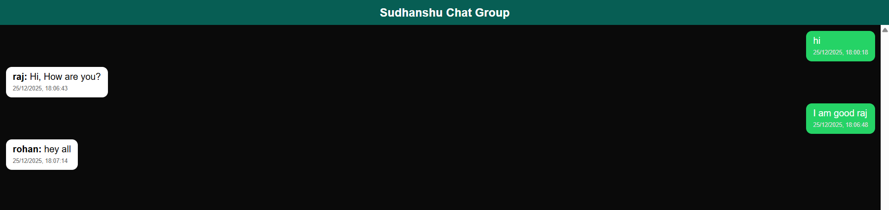

# Multi User Chat Application - DevOps Project

A real-time multi-user chat web application built with Node.js, Express, Socket.io, and React, featuring a complete DevOps pipeline With Jenkins & Github Action for automated deployment to Kubernetes on AWS Cloud. 



## DevOps Benefits & Highlights

This project demonstrates advanced DevOps practices for modern web applications:

- Every code commit generates a unique Docker image tag using Git commit SHA
- Ensures traceability: each deployment is tied to specific code changes
- Enables instant rollbacks to any previous version in case of failures.

### **Microservices Architecture**
- Separated frontend (React) and backend (Node.js + Socket.io) services
- Independent scaling and deployment of services
- Technology-agnostic development (React frontend, Node.js backend) And Mysql Database

### **Dynamic Configuration Management**
- Runtime URL configuration via Kubernetes ConfigMaps
- Environment-based database switching (SQLite for local, MySQL for production)
- Secrets management for database credentials
- Zero-downtime deployments with rolling updates


### **CI/CD Pipeline Excellence**
- **GitHub Actions**: Automated testing, code quality checks, and Docker image building
- **Jenkins**: Production deployment to EKS with dynamic image tagging

### **Cloud-Native Deployment**
- Kubernetes orchestration with LoadBalancer services
- AWS EKS for managed Kubernetes control plane
- RDS MySQL for production database

## Architecture Overview

The application follows a microservices architecture with separate containers for frontend and backend:

- **Frontend**: React application served by Nginx
- **Backend**: Node.js server with Socket.io for real-time messaging
- **Database**: SQLite (local) / MySQL (production)
- **Orchestration**: Kubernetes with ConfigMaps and Secrets

## Features

- **Real-Time Messaging**: Instant message delivery using Socket.io
- **Multi-User Chat**: Support for multiple concurrent users
- **Persistent Storage**: Messages saved to database with timestamps
- **WhatsApp-like UI**: Modern, responsive chat interface
- **User Authentication**: Simple username-based login
- **Containerized Deployment**: Docker + Kubernetes ready
- **Production Ready**: CORS enabled, environment configurations

## Local Development Setup

### Running Locally

1. **Clone the repository**:
   ```bash
   git clone https://github.com/sudhanshuvlog/Multi-User-ChatApp-Devops.git
   ```

2. **Install dependencies**:
   ```bash
   # Backend
   cd backend
   npm install

   # Frontend
   cd ../html
   npm install
   ```

3. **Start services**:
   ```bash
   # Backend (from backend directory)
   npm run dev

   # Frontend (from html directory)
   npm run dev
   ```

4. **Access the application**:
   - Open http://localhost:3000 in your browser
   - Login with any username to start chatting


## CI/CD Pipeline

### GitHub Actions (CI)
- **Triggers**: On PR raised to master branch
- **Unit Testing**: Runs tests for both backend and frontend
- **Docker Build**: Creates multi-stage production images
- **Image Tagging**: Tags with commit SHA + latest
- **Registry**: Pushes to Docker Hub

### Jenkins (CD)
- **Deployment**: Automated deployment to EKS cluster
- **Dynamic Tagging**: Uses commit SHA for image selection
- **Configuration**: Creates ConfigMaps and Secrets dynamically

## Production Deployment (Step By Step Guide)

### AWS Infrastructure Setup

1. **Create EKS Cluster** (see EKS setup section below)
2. **RDS MySQL Instance**: Create MySQL database for production
3. **Docker Hub**: Ensure images are pushed (automated via CI)

### Jenkins Pipeline Execution

The `Jenkinsfile` handles:
- Secret creation for database credentials
- Dynamic image tag replacement using commit SHA
- Kubernetes deployment with ConfigMaps for backend URL
- Rolling update status monitoring

### Environment Variables

**Backend**:
- `USE_LOCAL_DB`: `false` for production
- `DATABASE_URL`: From Kubernetes secret
- `NODE_ENV`: `production`

**Frontend**:
- `BACKEND_URL`: Injected via ConfigMap at runtime

## Testing

This project includes comprehensive test suites for both backend and frontend components.

### Backend Tests (Node.js + Jest)
- **Framework**: Jest with Supertest for API testing
- **Coverage**: API endpoints, authentication, database operations
- **Location**: `backend/tests/`

**Run Backend Tests:**
```bash
cd backend
npm test              # Run all tests
npm run test:watch    # Watch mode
npm run test:coverage # With coverage report
```

## EKS Cluster Setup (Step By Step)

1. **Fork & Clone the repository**:
    - Fork the repository https://github.com/sudhanshuvlog/Multi-User-ChatApp-Devops.git
    - Once you have forked the repo on your github account, Clone the repo in your system
        ```bash
        git clone <your repo URL>
        cd Movie-Streaming-App-DevOps
        ```

2. **Launch Server**
    - Launch an AWS EC2 Instance with `t2.medium` as Instance Type, and Give atleast 15GB of EBS Volume.
    - In `Security Group` you can allow all the trafic.

3. **Jenkins Setup**:

### Step 1: Launch Jenkins Server:
    ```bash
    docker run -p 8080:8080 -p 50000:50000 --name jenkins -dit --restart=on-failure -v jenkins_home:/var/jenkins_home jenkins/jenkins:lts-jdk21
    ```
    While Loging to jenkins webui at port 8080 you will have to run this command to retreive the default password
    ```bash
    docker exec -it 5668 cat /var/jenkins_home/secrets/initialAdminPassword
    ```

### Step 2: Configure Jenkins Slave Node:
   - Follow this doc to add a agent in Jenkins https://www.jenkins.io/doc/book/using/using-agents/
   - On your Jenkins slave node, install JDK 17(You can make your base Ec2 Instance as slave node):
    
    ``` bash
    wget https://download.oracle.com/java/17/archive/jdk-17.0.10_linux-x64_bin.rpm
    yum install jdk-17.0.10_linux-x64_bin.rpm -y
    ```
    - Start the agent and join it to the Jenkins Master Node using the provided join command.
    - Install `git` in slave node, as it will be further used while cloning the repo
        ```bash
        yum install git -y
        ```

### Step 3: Configure AWS Credentials
```bash
aws configure
```

### Step 4: Install eksctl
```bash
curl --silent --location "https://github.com/weaveworks/eksctl/releases/latest/download/eksctl_$(uname -s)_amd64.tar.gz" | tar xz -C /tmp
sudo mv /tmp/eksctl /usr/local/bin
eksctl version
```

### Step 5: Install kubectl
```bash
curl -o kubectl https://amazon-eks.s3.us-west-2.amazonaws.com/1.19.6/2021-01-05/bin/linux/amd64/kubectl
chmod +x ./kubectl
sudo mv ./kubectl /usr/local/bin
kubectl version --short --client
```

### Step 6: Create the EKS Cluster
```bash
eksctl create cluster --name EKSCHAT --region ap-south-1 --vpc-public-subnets=subnet-0e64ffc947ac8929c,subnet-04c1ed6ba9c55ffd7 --nodegroup-name default-ng --node-type t3.medium --nodes=2 --nodes-min=2 --nodes-max=2 --node-volume-size=20 --ssh-access --ssh-public-key DevOps --managed
```

## Project Structure

```
MultiChatApplication-Devops/
├── backend/                 # Node.js + Socket.io server
│   ├── server.js           # Main server file
│   ├── package.json        # Dependencies
│   └── Dockerfile          # Multi-stage build
├── html/                   # React frontend
│   ├── src/
│   │   ├── components/     # Login and Chat components
│   │   └── main.jsx        # App entry point
│   └── Dockerfile          # Nginx production build
├── k8s/                    # Kubernetes manifests
│   ├── backend-deployment.yaml
│   └── frontend-deployment.yaml
├── .github/workflows/      # GitHub Actions CI
├── Jenkinsfile             # Jenkins CD pipeline
├── docker-compose.yml      # Local development
└── README.md
```


## Contact

For questions or contributions, feel free to reach out!
